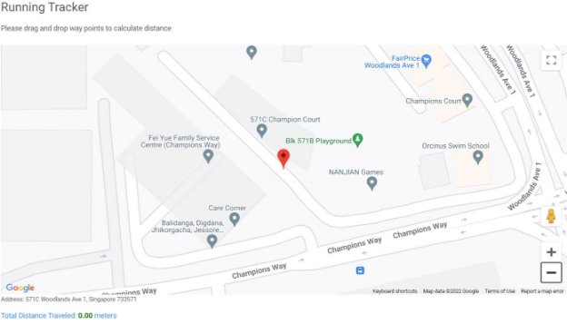

**Running Tracker!**

07\.07.2022

**─**

Nagarajan Govindarajan

Singapore

**Overview**

The web app will allow users to track the overall distance they traveled. Users need to drop way points on every turn they take.  The total traveled distance will be kept updated on every point drop.

**Goals**

1. Allows users to drop location waypoints on the map sequentially
1. Calculates the total distance of the route user traveled
1. App should start from user’s current location
1. App should show current address which user present

**Specifications**

Landing Page

The app will have a single page which will have a google map with current location pointed and current address will appear on bottom. Initially it will show the traveled distance as 0.

Dropping way points

Once the user starts running he/she will drop way points on each turn he / she takes. On each drop the total traveled distance will be updated.

**Technology Stack**

1. Angular

I have used Angular with typescript to create UI components. I have used Intellij Idea to develop and test the app.

2. Google map library

This app is backed by google map js library. The google map components have been used in UI to plot the marked running route.

**Validating distance with Google map**

Running Tracker Calculated Distance: 247.16 meter Google map Calculated Distance: 250 meter

**Running Tracker Technical Doc**

This project was generated with [Angular CLI](https://github.com/angular/angular-cli) version 10.1.3.

**Development server**

Runng serve for a dev server. Navigate tohttp://localhost:4200/. The app will automatically reload if you change any of the source files.

**Build**

Runng build to build the project. The build artifacts will be stored in thedist/ directory. Use the --prod flag for a production build.

**Running unit tests**

Runng test to execute the unit tests via [Karma](https://karma-runner.github.io/).

**Running end-to-end tests**

Runng e2e to execute the end-to-end tests via [Protractor](http://www.protractortest.org/).

**API Key**

For Demo, I have added my personal API key which will be deactivated after one week from assignment submission date.

**Dependencies used**

For Google maps npm i @angular/google-maps npm install @agm/core --save

npm i @types/googlemaps npm i @types/googlemaps

**Run Locally**

1\.Install latest nodejs 2.Install Latest Visual Studio Code 3.Import project into Visual Studio Code

4. Run "npm install" in terminal on project root path
4. Run "ng serve" in terminal on project root path

Note: If "ng" command does not work install angular cli using below command npm install -g @angular/cli@10.1.7
